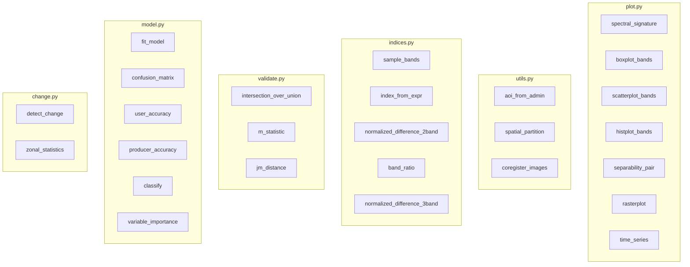

```mermaid
graph TD;
    subgraph plot.py
        P1[spectral_signature];
        P2[boxplot_bands];
        P3[scatterplot_bands];
        P4[histplot_bands];
        P5[separability_pair];
        P6[rasterplot];
        P7[time_series];
    end
    subgraph utils.py
        U1[aoi_from_admin];
        U2[spatial_partition];
        U3[coregister_images];
    end
    subgraph indices.py
        I1[sample_bands];
        I2[index_from_expr];
        I3[normalized_difference_2band];
        I4[band_ratio];
        I5[normalized_difference_3band];
    end
    subgraph validate.py
        V1[intersection_over_union];
        V2[m_statistic];
        V3[jm_distance];
    end
    subgraph model.py
        M1[fit_model];
        M2[confusion_matrix];
        M3[user_accuracy];
        M4[producer_accuracy];
        M5[classify];
        M6[variable_importance];
    end
    subgraph change.py
        C1[detect_change];
        C2[zonal_statistics];
    end
```